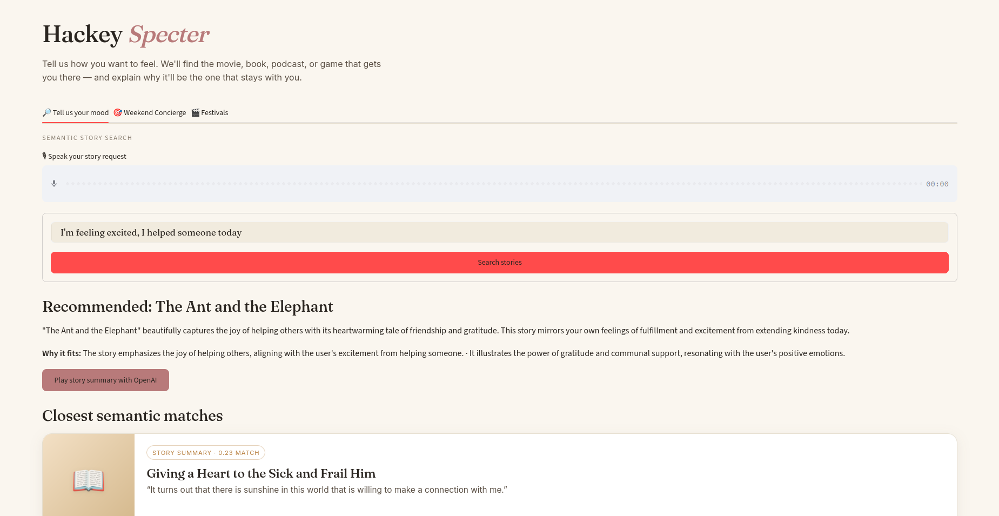

# Moodio

## Mood First Search for Pocket FM

Moodio turns vague emotional intent into story discovery for Pocket FM's curated storytelling catalog. Instead of asking people to choose a genre, it understands prompts such as “a rainy Sunday after heartbreak,” finds emotionally aligned stories, and explains why a title is likely to resonate.



## What it does

- Searches 40K+ curated stories using semantic vectors and mood-aware ranking.
- Gives a personalized recommendation and explains the emotional fit.
- Supports typed and voice story requests, plus optional generated audio summaries.
- Provides weekend and festival discovery flows for broader mood-led exploration.
- Captures out-of-catalog moods as demand signals—helping Pocket FM identify stories to produce, acquire, or promote next.

## How it works

1. Describe how you want to feel in everyday language.
2. Moodio embeds the request and retrieves the closest stories from its prebuilt vector index.
3. It presents the closest semantic matches, then personalizes a recommendation from those candidates.

The catalog is embedded offline with `text-embedding-3-large` at 3,072 dimensions. At search time, only the user's request is embedded.

## Run locally

```bash
python3 -m venv .venv
.venv/bin/pip install -r requirements.txt
.venv/bin/streamlit run app.py
```

The app expects `ultimate_pocketfm_vector_store.npz` in the repository root, or a full path in `RAG_VECTOR_STORE_PATH`.

### Free/local model mode

The app can run without OpenAI API credits using Ollama. Install Ollama, then pull a model:

```bash
ollama pull llama3.2
```

Set these values in `.env`:

```text
RAG_LLM_PROVIDER=ollama
RAG_FEATURE_MODEL=llama3.2
RAG_RERANK_MODEL=llama3.2
RAG_SEARCH_MODE=auto
```

In this mode intent extraction and recommendations use Ollama, and story retrieval uses the local lexical fallback instead of paid embedding requests. No OpenAI API key is needed. For free local voice transcription, install `faster-whisper`. Summary audio uses the operating system's offline speech engine through `pyttsx3`; existing story audio can also play.

```bash
pip install faster-whisper
```

## Deploy to Databricks Apps

Keep the 449 MB vector-store file out of Git. Upload it to a Unity Catalog volume, grant the App service principal `USE CATALOG`, `USE SCHEMA`, and `READ VOLUME`, then deploy:

```bash
databricks apps deploy moodio --source .
```

The app downloads the NPZ from the volume using the Databricks Files API and caches a local copy for the running App process. Configure `OPENAI_API_KEY` as a Databricks App secret before deploying.

## Stack

Python · Streamlit · OpenAI embeddings and Responses API · NumPy · Databricks Apps · Unity Catalog volumes
